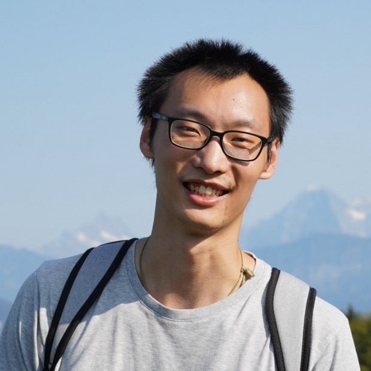

  

  

  

   
<strong>Tianlin Liu</strong>

    
 PhD candidate 

    
 University of Basel, Switzerland

  

<!--
 
 -->
   
I'm seeking full-time positions starting Fall or Winter 2024. If my experience would be a good fit for your organization, please feel free to contact me.  

I am a PhD candidate in machine learning, currently pursuing my studies at the University of Basel in Switzerland. My PhD advisor is [Prof. Ivan Dokmanić](https://dmi.unibas.ch/de/personen/ivan-dokmanic/).

In the fall of 2023, I interned at Google DeepMind in Paris. In the summer of 2022, I interned at Google Brain in Zurich.

I received BSc (2016) and MSc (2019) both from Jacobs University Bremen. During my time there, I completed my master's thesis under the guidance of [Prof. Herbert Jaeger](https://www.ai.rug.nl/minds/).

<a href="files/Tianlin_Liu_CV.pdf">CV</a> – <a href="https://scholar.google.de/citations?user=1bbQjM4AAAAJ&hl=en">Google Scholar</a> – <a href="http://github.com/liutianlin0121"> GitHub </a> – <a href="https://twitter.com/tianlinliu0121">Twitter</a>

### News

* **Oct  2023**: Check out our [blog post](https://huggingface.co/blog/the_n_implementation_details_of_rlhf_with_ppo) (with Costa Huang and Leandro von Werra) for a detailed breakdown of OpenAI's first RLHF paper, featuring results replicated in PyTorch and Jax.
  
* **Jan  2023**: Our [paper](https://arxiv.org/abs/2209.15466) (with Joan Puigcerver and Mathieu Blondel) has been accepted by ICLR 2023 as a spotlight presentation.

* **May  2022**: Our [paper](https://ieeexplore.ieee.org/stamp/stamp.jsp?tp=&arnumber=9775596) (with Anadi Chaman, David Belius, and Ivan Dokmanić) has been accepted by the IEEE Transactions on Computational Imaging.

* **Jan 2022**: Our [paper](https://arxiv.org/pdf/2110.03303.pdf) (with Anastasis Kratsios, Behnoosh Zamanlooy, and Ivan Dokmanić) has been accepted by ICLR 2022 and selected for a spotlight presentation.

* **June  2020**: Our [paper](https://arxiv.org/abs/2006.08228) (with Friedemann Zenke) on training sparse neural networks has been accepted by ICML 2020.

* **November  2019**: Our [paper](https://arxiv.org/abs/1911.10524) (with Zekun Yang) on word vector denoising has been accepted by AAAI 2020.

* **August 2019**: My [master's thesis](/files/MSc_thesis_TianlinLiu.pdf) has been awarded a Deans Prize for outstanding thesis by Jacobs University Bremen.

* **March 2019**: Our [paper](https://www.ai.rug.nl/minds/uploads/3158_Heetal19.pdf) (with Xu He,  Fatemeh Hadaeghi, and Herbert Jaeger) on training spiking neural networks for neuromorphic hardware won a best paper finalist award at IEEE NER-2019

<!--
* **March 2019**: I attended IEEE NER-2019.

* **March 2019**: I attended IK-2019

* **March 2019**: I attended Cosyne-2019.

* **February  2019**: Our paper (with João Sedoc and Lyle Ungar)  on continual sentence representation learning has been accepted by NAACL 2019.

* **February 2019**: I will be joining the lab of  Dr. Friedemann Zenke as a PhD student at Friedrich Miescher Institute for Biomedical Research (FMI) Basel! 

* **December 2018**: Our paper (with Xu He,  Fatemeh Hadaeghi, and Herbert Jaeger) on Reservoir Transfer has been accepted to NER-2019.

* **November 2018**: Our paper (with João Sedoc and Lyle Ungar) on word vector post-processing has been accepted by AAAI 2019.

* **September 2018**: I attended the Bernstein Conference 2018.

* **August 2018**:  I received a travel award to present at BioCreative/OHNLP workshop at the ACM-BCB 2018, Washington, D.C. 

* **August 2018**: My paper on learning Observable Operator Models from data containing missing values is available on arxiv.

* **June 2018**: Our paper on Fast Binary Compressive Sensing has been accepted by 5th CoSeRa 2018.

* **May 2018**: I started my summer research internship with Lyle Ungar at Upenn.

* **April 2018**: I have been awarded with the SMARTSTART1 Training Fellowship of Computational Neuroscience by the Bernstein Network and the Volkswagen Foundation.

* **March 2018**: I had a one-week research visit at the Institute of Neuroinformatics of UZH and ETH, Switzerland.
March 2018: I attended IK-2018, Moehnesee, Germany.

* **Feb 2018**: I attended AAAI-2018, New Orleans, USA.

* **November 2017**: Our paper on Predicting Engagement Breakdown in HRI has been accepted to the AAAI-2018 workshop on Affective Content Analysis.

* **September 2017**: I attended the 2nd Young Researchers Event and the Codejam of the Human Brain Project (HBP) in Geneva and Lausanne, Switzerland. 
-->
